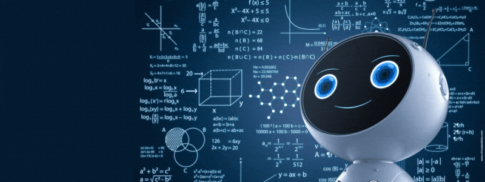

<!--
    Hey there, I'm Aditya Ashok Pise!
    Happy to see you here exploring GitHub
-->

<a href="https://adityapise.vercel.app/" download>Check out my Portfolio</a>

    

<!--
     My mission, because I'm a superhero!
-->

### My mission
I’m driven by a love for solving problems! With a technical background, I’ve always found my place in connecting people and working closely with businesses. My mission is to bridge connections, empower collaboration, and tackle real-world challenges that make a meaningful difference.

<!--
     This is the list of my skills and tools I am studying!
-->

### Main skills

### Studying

<!--
     I also have my own blog with useful information, check it out ^^
-->

### Connect with me!

    

### Employer?
> [!IMPORTANT]  
> <a href="https://drive.google.com/file/d/10Ti0NIyS0Qqi0hs1KBxNk8YQptoyNOjb/view?usp=sharing" download>Download my resume</a>

<!--
     Thanks
-->
